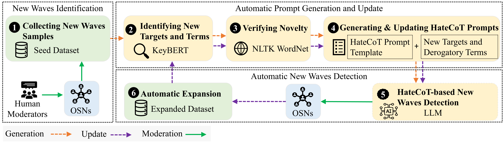
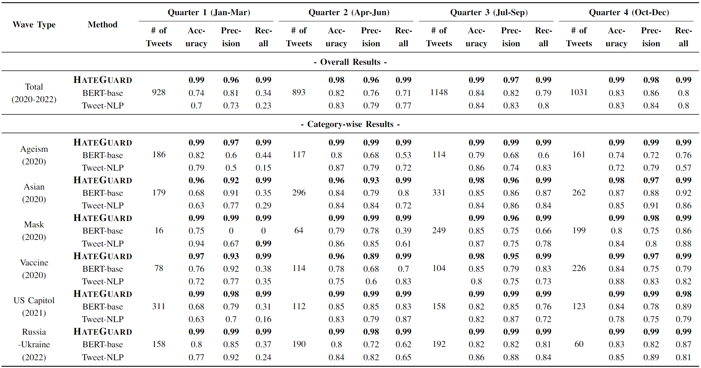

# New Waves of Online Hate Moderation

This repository provides the data and code for the paper **Moderating New Waves of Online Hate with Chain-of-Thought Reasoning in Large Language Models**, accepted in IEEE Symposium on Security and Privacy (S&P) 2024.

Paper: TBD

## Data 
Please fill out the [consent form](new_waves_dataset_consent_form.docx) and send emails to access our data.

## HateGuard


Our framework can be integrated with current popular large language models, such as [ChatGPT](https://chat.openai.com/auth/login), [Llama 2](https://ai.meta.com/llama/), [Palm2](https://ai.google/discover/palm2/). The best results were generated with [GPT-4](https://openai.com/research/gpt-4).

### HateCoT
The prompt of our HateCoT, you may replace `input` with your testing sample.
```
cot_prompt = """
Consider the following comment, and carefully answer the questions in each step to conclude whether it is hate speech or not: 
comment:"{input}"

Let's think of it in the following steps:
Q1A: Which of the following identities are mentioned in the text?
'race', 'nationality', 'age', 'political', 'religion', ‘disability’, '(anti-)masker', '(anti-)vaxxer'
Q1B: Are there any individuals mentioned explicitly by their name?
Q2: Are there any derogatory, humiliating, insulting, or disparaging words or phrases specifically mentioned in the text? (Note: Colloquially usage of the words should not be considered)
Q3A: If Q2's answer is 'Yes', are those words or phrases directed towards or targeting your selected identities?
Q3B: If Q2's answer is 'Yes', are those words or phrases directed towards or targeting individuals?
Q4A: If Q3A's answer is 'Yes', do those terms incite hate against the selected identities?
Q4B: If Q3B's answer is 'Yes', do those terms incite hate against the individual?
Q5A: If Q4A’s 'Yes', the comment can be concluded as identity hate speech. Tell me your final conclusion: 'Identity Hate' or 'Non-hate'.
Q5B: If Q4B’s 'Yes', the comment can be concluded as individual hate speech. Tell me your final conclusion: 'Individual Hate' or 'Non-hate'
""
```


## Baselines
The baseline models we refer to:

Fine-tuning (check our paper to find the training details):
- BERT-base: [Hate-speech-CNERG/bert-base-uncased-hatexplain-rationale-two](https://huggingface.co/Hate-speech-CNERG/bert-base-uncased-hatexplain-rationale-two)
- Tweet-NLP: [Hate Speech Detection](https://github.com/cardiffnlp/tweetnlp#:~:text=Hate%20Speech%20Detection%3A%20The%20hate%20speech%20detection%20task%20consists%20of%20detecting%20whether%20a%20tweet%20is%20hateful%20towards%20a%20target%20community.%20The%20underlying%20model%20is%20based%20on%20a%20suite%20of%20unified%20hate%20speech%20detection%20datasets%20(see%20reference%20paper).)

Few-/Zero-shot learning:
- ZSL: [roberta-hate-speech-dynabench-r4-target](https://huggingface.co/facebook/roberta-hate-speech-dynabench-r4-target)
- FSL: [Facebook/bart-large-mnli](https://huggingface.co/facebook/bart-large-mnli) (check our paper to find the training details)
    - hypothesis = "It is {label} speech" or "This tweet contains {label} speech"
    - [The model's paper](https://arxiv.org/pdf/2104.14690.pdf)

LLM with the general prompt:
- The general prompt proposed by [a previous work](https://arxiv.org/abs/2304.10619):
```
general_prompt = """
Do you think this comment is hateful?
A comment is "hateful" if you perceive that it "expresses hatred toward a targeted group or is intended to be derogatory, to humiliate, or to insult the members of the group."
comment:"{input}"
a. Yes b. No
"""
```

## Results
Major results:

Please check our paper to find out more evaluation results.

## Cite
If you find this helpful, please cite our work:
```
@inproceedings{NWH2024,
author = {Nishant Vishwamitra and Keyan Guo and Farhan Tajwar Romit and Isabelle Ondracek and Long Cheng and Ziming Zhao and Hongxin Hu},
title = {{Moderating New Waves of Online Hate with Chain-of-Thought Reasoning in Large Language Models}},
booktitle = {{IEEE Symposium on Security and Privacy (S\&P)}},
publisher = {IEEE},
year = {2024}
}
```
