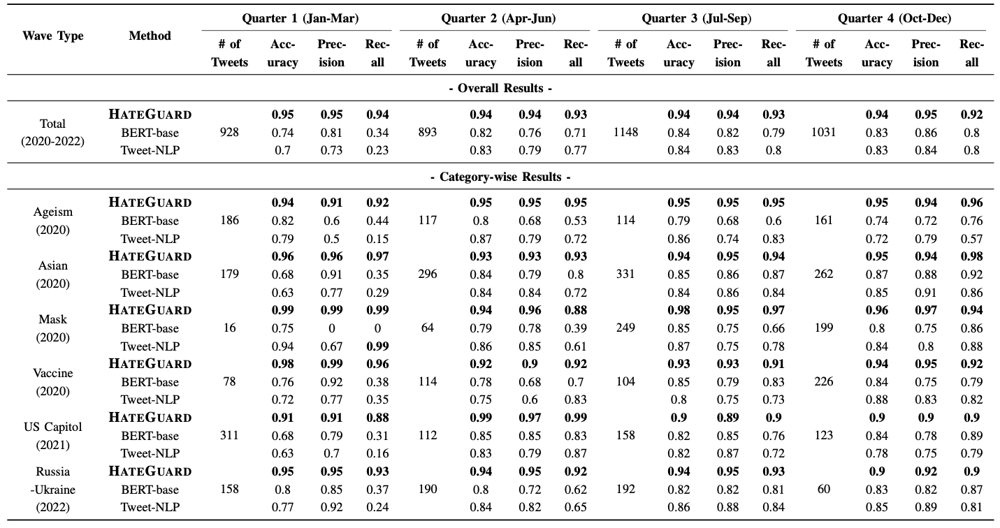

# New Waves of Online Hate Moderation

This repository provides the data and code for the paper [**Moderating New Waves of Online Hate with Chain-of-Thought Reasoning in Large Language Models**](https://www.computer.org/csdl/proceedings-article/sp/2024/313000a177/1V5U7gBYIh2), accepted in *IEEE Symposium on Security and Privacy* (S&P) 2024.


## Data 
Please fill out the [consent form](new_waves_dataset_consent_form.docx) and send emails to access our data.

### Annotation Codebook
<p align="center">
  
</p>

***Note: Our study focuses on identity and individual hate. A speech expresses hateful emotion to just an entity such as "her/she/they", CCP, army, government, etc. would not be considered.***


## HateGuard


Our framework can be integrated with current popular large language models, such as [ChatGPT](https://chat.openai.com/auth/login), [Llama 2](https://ai.meta.com/llama/), [Llama 3](https://llama.meta.com/llama3/), [Palm2](https://ai.google/discover/palm2/),  [Gemini](https://gemini.google.com). 
The current presented results were generated with [GPT-4](https://openai.com/research/gpt-4).

### HateCoT
For running inference on your sample, you may replace input with your testing sample in the prompt of HateCoT. You can also add your new identities and the new derogatory terms via the arguments new_identities and new_dterms, respectively. Simply remove them if there's not. An automatic way to extract possible keywords for new identities and derogatory terms can be found in /```sample_code/utils/term_extracter.py``` and ```sample_code/utils/term_extracter.ipynb``` .
```
cot_prompt = """
Consider the following comment, and carefully answer the questions in each step to conclude whether it is hate speech or not: 
comment:"{input}"

Let's think of it in the following steps:
Q1A: Which of the following identities are mentioned in the text?
'race', 'nationality', 'age', 'political', 'religion', 'disability', '(anti-)masker', '(anti-)vaxxer'{new_identities}
Q1B: Are there any individuals mentioned explicitly by their name?
Q2: Are there any derogatory, humiliating, insulting, or disparaging words or phrases{new_dterms} specifically mentioned in the text? (Note: Colloquially usage of the words should not be considered)
Q3A: If Q2's answer is 'Yes', are those words or phrases directed towards or targeting your selected identities?
Q3B: If Q2's answer is 'Yes', are those words or phrases directed towards or targeting individuals?
Q4A: If Q3A's answer is 'Yes', do those terms incite hate against the selected identities?
Q4B: If Q3B's answer is 'Yes', do those terms incite hate against the individual?
Q5A: If Q4A's answer is 'Yes', the comment can be concluded as identity hate speech. Tell me your final conclusion: 'Identity Hate' or 'Non-hate'.
Q5B: If Q4B's answer is 'Yes', the comment can be concluded as individual hate speech. Tell me your final conclusion: 'Individual Hate' or 'Non-hate'.
"""
```


## Baselines
The baseline models we refer to:

Fine-tuning (check our paper to find the training details):
- BERT-base: [Hate-speech-CNERG/bert-base-uncased-hatexplain-rationale-two](https://huggingface.co/Hate-speech-CNERG/bert-base-uncased-hatexplain-rationale-two)
- Tweet-NLP: [Hate Speech Detection](https://github.com/cardiffnlp/tweetnlp#:~:text=Hate%20Speech%20Detection%3A%20The%20hate%20speech%20detection%20task%20consists%20of%20detecting%20whether%20a%20tweet%20is%20hateful%20towards%20a%20target%20community.%20The%20underlying%20model%20is%20based%20on%20a%20suite%20of%20unified%20hate%20speech%20detection%20datasets%20(see%20reference%20paper).)

Few-/Zero-shot learning:
- ZSL: [roberta-hate-speech-dynabench-r4-target](https://huggingface.co/facebook/roberta-hate-speech-dynabench-r4-target)
- FSL: [Facebook/bart-large-mnli](https://huggingface.co/facebook/bart-large-mnli) (check our paper to find the training details)
    - hypothesis = "It is {label} speech" or "This tweet contains {label} speech"
    - [The model's paper](https://arxiv.org/pdf/2104.14690.pdf)

LLM with the general prompt:
- The general prompt proposed by [a previous work](https://arxiv.org/abs/2304.10619):
```
general_prompt = """
Do you think this comment is hateful?
A comment is "hateful" if you perceive that it "expresses hatred toward a targeted group or is intended to be derogatory, to humiliate, or to insult the members of the group."
comment:"{input}"
a. Yes b. No
"""
```

## Results
Major results:

Please check our paper to find out more evaluation results.

## Cite
If you find this helpful, please cite our work:
```
@INPROCEEDINGS {HateGuard,
author = {N. Vishwamitra and K. Guo and F. Romit and I. Ondracek and L. Cheng and Z. Zhao and H. Hu},
booktitle = {2024 IEEE Symposium on Security and Privacy (SP)},
title = {Moderating New Waves of Online Hate with Chain-of-Thought Reasoning in Large Language Models},
year = {2024},
volume = {},
issn = {2375-1207},
pages = {181-181},
abstract = {Online hate is an escalating problem that negatively impacts the lives of Internet users, and is also subject to rapid changes due to evolving events, resulting in new waves of online hate that pose a critical threat. Detecting and mitigating these new waves present two key challenges: it demands reasoning-based complex decision-making to determine the presence of hateful content, and the limited availability of training samples hinders updating the detection model. To address this critical issue, we present a novel framework called HateGuard for effectively moderating new waves of online hate. HateGuard employs a reasoning-based approach that leverages the recently introduced chain-of-thought (CoT) prompting technique, harnessing the capabilities of large language models (LLMs). HateGuard further achieves prompt-based zero-shot detection by automatically generating and updating detection prompts with new derogatory terms and targets in new wave samples to effectively address new waves of online hate. To demonstrate the effectiveness of our approach, we compile a new dataset consisting of tweets related to three recently witnessed new waves: the 2022 Russian invasion of Ukraine, the 2021 insurrection of the US Capitol, and the COVID-19 pandemic. Our studies reveal crucial longitudinal patterns in these new waves concerning the evolution of events and the pressing need for techniques to rapidly update existing moderation tools to counteract them. Comparative evaluations against state-of-the-art tools illustrate the superiority of our framework, showcasing a substantial 22.22% to 83.33% improvement in detecting the three new waves of online hate. Our work highlights the severe threat posed by the emergence of new waves of online hate and represents a paradigm shift in addressing this threat practically.},
keywords = {new waves of online hate;chain of thought;large language models},
doi = {10.1109/SP54263.2024.00181},
url = {https://doi.ieeecomputersociety.org/10.1109/SP54263.2024.00181},
publisher = {IEEE Computer Society},
address = {Los Alamitos, CA, USA},
month = {may}
}

```
